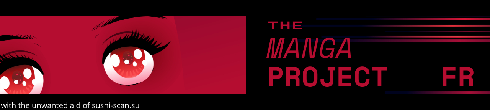
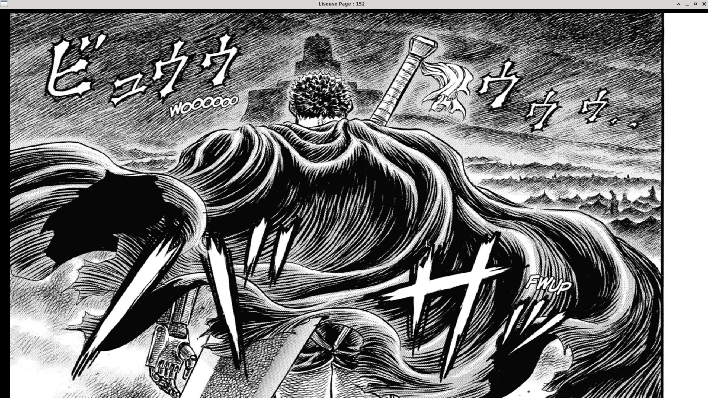

# Intro
Je voulais lire Berserk.
Sushi-scan est les meilleur site de scan "gratuit". 

Mais : 
- trop de pub (en haut, en bas, sur les cotés, addBlock est dectecté , une horreur)
- quand tu change de page elle ne revien pas au bon niveau
- on peux pas zoomer sur l'image elle meme

Le but de mon projet : rendre l'environement de lecture infiniment plus agréable.
De

A



# Usage and install

The makefile is at the root (need the SFML library) :
```
make 
./liseuse MangaName Tome Page UploaderNumber
berserk : ./liseuse Berserk  1 0 -1
one punch man : ./liseuse OPM 1 0 2
```
En inspectant une page dans le navigateur, la page sushi-scan qui vous intéresse, vous verré dans la parti network les call que fais le site a chaque changement de page, ca devrait resemblé a ca : "https://i0.wp.com/sushi-scan.su/wp-content/uploads2/OPMTome1-001.jpg". De cela vous pourrait tirrer vos argument :
- MangaName : tout ce qui ya avant "Tome" jusqu'au '/'  ici OPM

- Tome : start at 1

- UploaderNumber : numéro apres "upload" dans l'url qu'on pillent. 
-1 si il n'y a pas de numéro.

C'est un peu fastidieu je sais ne vous inquité pas je rajoueterai un parseur qui ferra ca pour vous un jour. Il marche pas avec tout les mangas,certaint n'ayant pas le meme début d'url, ce probleme sera réglé avec le parseur, d'autre n'étant pas stoké en jpg, le probleme sera réglé au cas par cas.  


#### Simple and Fast Multimedia Library (SFML )
`sudo apt-get install libsfml-dev`
OR
`sudo dnf install SFML-devel.x86_64`

#### Control

##### Mode normal
1. Click droit : page suivante
1. Click milieu : precedente
1. Molette : up - down de la page
1. Molette + crl : zoom
1. Click gauche : mode libre

##### Mode libre
1. La page suis les mouvment de sourit
1. Molette : zoom
1. Click gauche : mode normal

esc: exit

